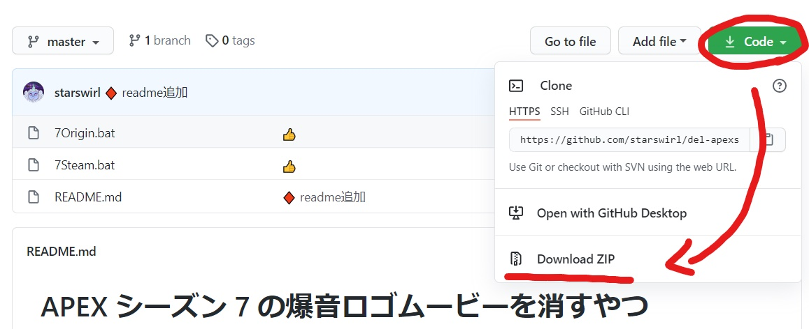
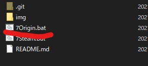
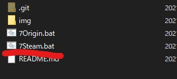

# APEX の爆音ロゴムービーを消すやつ

アップデートの度に爆音ロゴムービーのムービーファイル消すのがめんどいので作りました。

シーズン変わっても今のところ使えているのでアプデの度一回起動するといいよ

(もちろんちょっといじってスタートアップに入れれば
PC 起動毎にアプデファイル削除できるようにもできるよ)

落として自責で bat 起動する

## 前提条件

インストール先フォルダがデフォルトであること
(変えている場合はバッチファイル適当にいじってね

ファイルを削除するコマンドが含まれるので自己責任でお願いします

## 使い方

1. git リポジトリ(ブラウザ表示画面)から下記画像を参考に zip ファイルをダウンロードする

### Origin 版

    1. 7Origin.bat を起動 ※cmd 画面が出れば削除対象ファイルがある

    2. 削除して問題なければ Y を入力して Enter で削除完了

### Steam 版

    1. 7Steam.bat を起動 ※cmd 画面が出れば削除対象ファイルがある

    2. 削除して問題なければ Y を入力して Enter で削除完了
